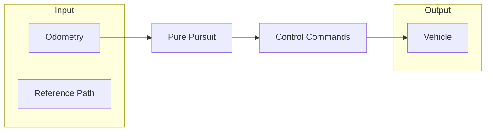

```bash
# Clone Repository
git clone https://github.com/GIU-F1Tenth/pure_pursuit.git
cd pure_pursuit

# Install dependencies
pip install -r requirements.txt

# ROS2 Compilation of the working space
colcon build --packages-select pure_pursuit
source install/setup.bash
```
# software
```python
# Initiate the controller node
ros2 run pure_pursuit pure_pursuit_node \
    --ros-args -p csv_path:=/path/to/raceline.csv \
               -p max_velocity:=3.0 \
               -p min_velocity:=0.5 \
               -p kp:=0.8
```
Use `source ~/ros_humble/install/setup.bash` to source humble on the car.

# SLAM 
- ros2 launch nav2_bringup slam_launch.py params_file:=src/giu_f1t_system/f1tenth_stack/config/f1tenth_online_async_mapping.yaml 
 
- ros2 run nav2_map_server map_saver_cli 

- scp ubuntu@[ip]:/home/ubuntu/giu_f1tenth_ws/software/map_number.pgm /path/to/where/to/save/map.pgm

- convert input.png -colorspace Gray output.png /path/to/map.pgm
